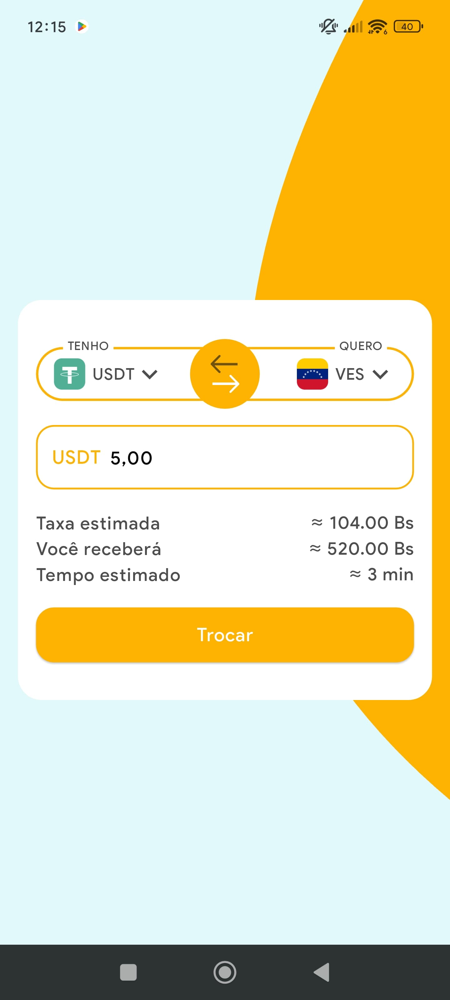
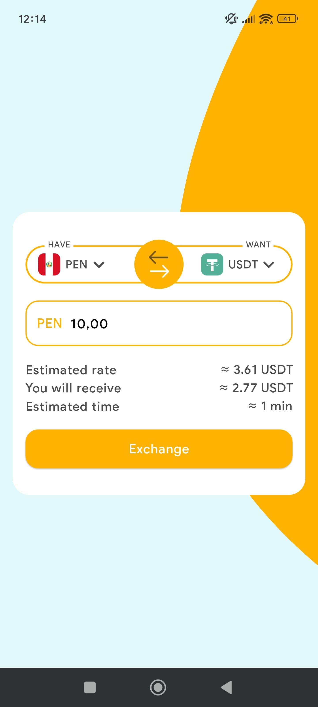

# Currency Exchange Challenge 💱

This project was developed as part of the **El dorado** technical challenge. The goal is to build a small currency exchange calculator that shows how much a user will receive when converting a certain amount from one currency to another (FIAT ⇄ CRYPTO).

## 📱 Preview

---

## 🚀 Features

- Input a value in any supported FIAT or CRYPTO currency
- Automatically fetch exchange rates from public API
- Display:
  - Estimated rate
  - Total received
  - Estimated time to process
- Switch between different currencies
- Reactive UI with real-time updates
- Internationalization (i18n): English, Spanish and Portuguese
- Light and Dark theme ready (WIP)
- Unit tested core logic

---

## 🛠️ Tech Stack

| Category                  | Technology        |
|--------------------------|-------------------|
| 🧠 Architecture           | Clean Dart        |
| 📦 State Management       | Triple            |
| 💉 Dependency Injection   | Modular           |
| 🌍 Routing                | Modular           |
| 🌐 HTTP Client            | Dio               |
| 🌎 Internationalization   | Flutter Intl (l10n) |
| ✅ Testing                | Unit Tests        |

---

## 🧪 Testing

Unit tests have been implemented for core business logic and use cases. The architecture ensures that each layer can be tested in isolation.

## 🎯 Possible Improvements

 - Improve test coverage to 100% on store
 - Refactor some components for better scalability and code readability
 - Add full support for Dark and Light theme switching
 - Cache exchange rates to reduce API usage